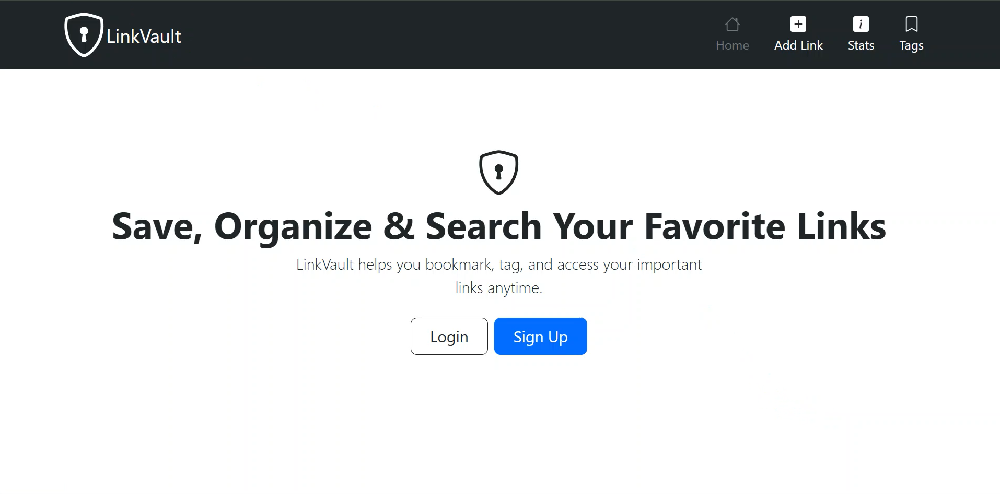
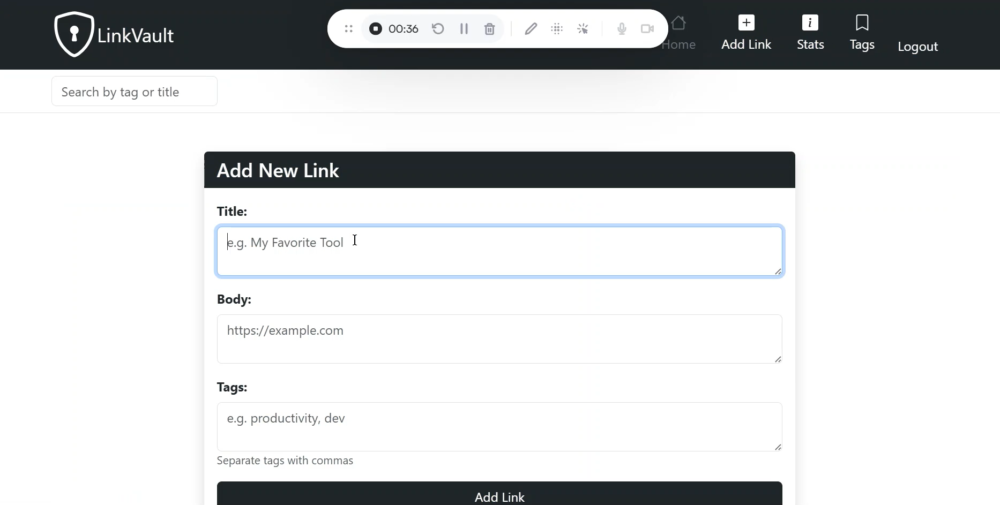
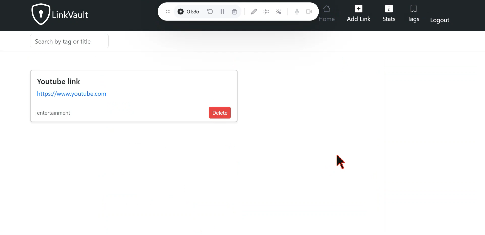

# 🔗 LinkVault

LinkVault is a personal bookmark manager built with Flask.  
It allows users to save, tag, search, update, and delete bookmarks — all with user authentication.

## 🌟 Features

- User authentication (login/signup/logout)
- Add, update, delete bookmarks
- Tagging system for bookmarks
- Search by title or tag
- Clean, responsive UI (Bootstrap)

## 🚀 Tech Stack

- Python
- Flask
- SQLAlchemy
- Bootstrap 5

## 📸 Screenshots

### 🏠 Home Page


### ➕ Add Bookmark



### ➕ Display


## 🛠️ Installation

1. Clone the repo:
```bash
git clone https://github.com/yourusername/linkvault.git
cd linkvault
Create a virtual environment and activate it:

bash
Copy
Edit
python -m venv venv
source venv/bin/activate   # On Windows: venv\Scripts\activate
Install dependencies:

bash
Copy
Edit
pip install -r requirements.txt
Run the app:

bash
Copy
Edit
flask run
🔐 Environment
Ensure your app has a secret key:

python
Copy
Edit
app.secret_key = 'very_secret_key'
📝 License
MIT License

yaml
Copy
Edit
